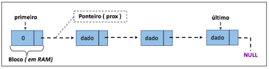

# MÁXIMA SOMA
Crie uma lista linear que consiga armazenar um conjunto de 100 nomes quaisquer, os quais serão salvos de forma aleatória. Feito a estrutura crie as seguintes ações:   
Uma função que consiga identificar replicações na lista, ou seja, nomes iguais. Removatodas as réplicas sem mover os ”ponteiro“;   
Como você gerenciaria os espaços em branco para novas inserções? Qual seria o custo dessas novas inserções?
# Logica
Foi-se feito um programa com a seguinte lógica:    
Existe uma lista dinâmica **l** contendo itens de *char value[100]* e *int cont* da maneira (Baseado de : [vide git](https://github.com/mpiress/dynamic_list)):
>

>A lista dinâmica é uma variante do modelo estático [vide git](https://github.com/mpiress/linear_list). Assim, antes de apresentar as modificações existêntes nessa implementação, vejamos uma representação gráfica do modelo dinâmico em questão. Observe as nomenclaturas utilizadas na figura, essas são utilizadas na implementação fornecida, as quais podem estar definidas/parametrizadas no idioma inglês.
>

>

>	 
>

>

>Note pela figura que, o primeiro bloco armazenado em RAM não apresenta o tipo dado como parte da estrutura, mas sim um valor 0 <b>"simbólico"</b>. Isso porque é >preciso inserir na estrutura o que chamaremos de cabeça da lista. A cabeça de uma lista nada mais é que um ponteiro <i>vazio</i> (i.e., um tipo similar ao void) que >indica qual posição de memória será utilizada como base/início da lista. 
>

>

>Uma outra nomenclatura a ser observada na figura é a existência de um ponteiro <b>prox</b>. Este tem por objetivo apontar para o próximo bloco de memória que conterá >o novo dado ou para NULL, o que facilita a navegação entre os blocos e a idenficação do fim da lista. Este ponteiro se mostra imprescindível, uma vez que abandonamos >o modelo sequencial de memória e adotamos um conceito cujos blocos estão em endereços aleatórios. Nesse novo modelo, inserções, remoções, pesquisas e impressões da >lista são apoiadas por dois outros ponteiros, o <b>primeiro</b> e o <b>último</b>, conforme representação da figura.
>

>Qual a função dos ponteiros <b>primeiro</b> e <b>ultimo</b>?
>
>Como a lista é composta de blocos espalhados na memória, torna-se necessário identificar qual bloco representa a cabeça da lista. Para isso, é utilizado o ponteiro primeiro. Da mesma forma, identificar o último bloco também se torna importante, uma vez que, novas inserções são realizadas sempre no final dessa estrutura com o objetivo de facilitar sua manipulação.
>

>Se considerarmos um computador hipotético com 8Mb de RAM distribuídos em dois pentes de 4Mb cada, uma representação da lista dinâmica poderia ser compreendida da seguinte forma:
>

>

>	 
>
 

1) Ao entrar no programa a primeira função encontrada é *FLVazia(&l)* (Baseado de : [vide git](https://github.com/mpiress/dynamic_list)):
>Função responsável por criar um espaço de memória para ser a cabeça da lista. Para tanto, é utilizado a chamada de função nativa do C/C++ malloc, o qual recebe como referência o espaço a ser reservado por meio da diretriz sizeof. Nesse primeiro momento, o casting (i.e., conversão de um tipo void criado pelo malloc para um tipo específico) se torna opcional, sendo utilizado na codificação apenas para manter um único padrão de definição de função. Como pode ser observado no código disponibilizado, o endereço produzido pela execução do malloc é copiado para o ponteiro primeiro e último, mantendo ambos no mesmo endereço. O que significará que a lista se encontra vazia. Por fim, apontamos o prox de ambos os ponteiros para NULL.    

2) Em seguida pergunta-se ao usuário se ele possui um arquivo pronto contendo os nomes ou não, se não:    

- Iguala o nome de uma variável *char arquivo[80]* a "ArquivoNomes.txt", e manda o endereço de l, arquivo e false para a função *preencheLista(Lista *l,char f[80], bool novo)*

se sim:

- Pergunta ao usuário o nome do arquivo que possui os dados e o copia para *char arquivo[80]*, mandando o endereço de l, arquivo e true para a função *preencheLista(Lista *l,char f[80], bool novo)*

2) A função *preencheLista(Lista *l,char f[80], bool novo)* tem o objetivo de preencher **l**, usando um arquivo de formato;
>a1 
>a2 
>a3 
>a... 
>an 
>
>onde *a* é um nome

caso novo seja verdadeiro, chama-se a função *preencheArquivo(f)* que recebe nomes do usuário com no máximo 100 caracteres e os insere linha a linha no arquivo f enviado ("ArquivoNomes.txt"), igualando seus *int cont* a 0;    
Após verificar se a leitura do arquivo é possível (caso inválido da exit)se insere os elementos na lista, a primeira ação a ser realizada é reservar espaço em memória para esse novo dado. Para isso, o apontador cauda deve apontar em memória para o endereço do novo bloco cujo prox apontará para NULL.

3) A seguir é apresentado um menu para o usuário com as seguintes opções:    
- 1- Inserir nome:
    1. Usa a mesma lógica de **Inserir** de  [vide git](https://github.com/mpiress/dynamic_list);

- 2- Remover:
    1.  Usa a mesma lógica de **Remover** de  [vide git](https://github.com/mpiress/dynamic_list);

- 3- Remover iguais:
    1. O programa seta uma ponteiro percorre igual à cabeça da lista (*l->cabeca*), entra-se então em um loop que irá igualar *percorre=percorre->prox* a cada iteração enquanto *percorre->prox* não for nulo (uma maneira de percorrer a lista), logo após setamos *remove=percorre->prox* e começamos um loop interno da mesma maneira do externo que compara o valor de *remove->prox->dado.value* com *percorre->prox->dado.value*, caso sejam iguais:
        - Verifica se *remove->prox->dado.value* é o último valor da lista, se sim o exclui, seta a cauda como remove e o remove->prox como NULL, se não seta o remove->prox como remove->prox->prox e exclui remove->prox com auxílio de *freeBloco* que guarda a posição anterior de remove->prox;
     2. Caso contrário:
        - percorre o loop para o próximo elemento;

- 4- Printar lista:
    1. Imprime a lista de nomes da lista; 

- 5- Mostrar repetições:
    1. O programa seta uma ponteiro percorre igual à cabeça da lista (*l->cabeca*), a função percorre a lista setando os valores de *cont* de cada uma, sendo cont=-1 caso seja um repetição. Entra-se em um loop de *percorre->prox* onde enquanto *percorre->prox* não for nulo, no final do looping *percorre=percorre->prox*, existe no começo de cada looping uma verificação para ver se percorre é ou não uma repetição, caso não seja:
        - o contador de percorre é aumentado em um;
    1. depois da verificação começamos um looping interno da mesma maneira do externo com um ponteiro *repet=percorre->prox* para verificar se os outros valores da lista são repetições ou não, caso sejam:
        - Adiciona 1 a *percorre->prox->dado.cont* e seta o contador de *repet*=-1;

- 8- Atualizar arquivo:
    1. A função *atualizaArquivo(Lista *l,char nomearquvio[80])* abre um arquivo com o nome enviado a ela, e escreve os nomes de lista linha a linha nesse arquivo;

- 9- Sair (Arquivo atualizado):
    1. Utiliza a função *atualizaArquivo(Lista *l,char nomearquvio[80])* e sai do programa;

- 0-Sair (Não atualizar arquivo):
    1. Sair do programa.

Obs.:    
- O arquivo deve ser dado na mesma maneira que o apresentado e deve conter apenas nomes de até 100 caracteres
# Exemplo de execução
Arquivos:

	 
	 

 

Execução:

	 

	 

 

# Compilação e Execução

O programa possui um arquivo Makefile que realiza todo o procedimento de compilação e execução. Para tanto, temos as seguintes diretrizes de execução:

| Comando                |  Função                                                                                           |                     
| -----------------------| ------------------------------------------------------------------------------------------------- |
|  `make clean`          | Apaga a última compilação realizada contida na pasta build                                        |
|  `make`                | Executa a compilação do programa utilizando o gcc, e o resultado vai para a pasta build           |
|  `make run`            | Executa o programa da pasta build após a realização da compilação                                 |
